<a href="https://soufiane.app/en"><picture><source media="(prefers-color-scheme: dark)" srcset="assets/dark/hero.svg"></picture></a>

 

<picture><source media="(prefers-color-scheme: dark)" srcset="assets/dark/about.svg"></picture>

 

<a href="https://soufiane.app/en#skills"><picture><source media="(prefers-color-scheme: dark)" srcset="assets/dark/toolbox.svg"></picture></a>

 

<a href="https://soufiane.app/en#projects"><picture><source media="(prefers-color-scheme: dark)" srcset="assets/dark/work.svg"></picture></a>
<a href="https://soufiane.app/en#projects"><picture><source media="(prefers-color-scheme: dark)" srcset="assets/dark/work-01.svg"></picture></a>
<a href="https://soufiane.app/en#projects"><picture><source media="(prefers-color-scheme: dark)" srcset="assets/dark/work-02.svg"></picture></a>
<a href="https://lemarchedaressalam.ma/"><picture><source media="(prefers-color-scheme: dark)" srcset="assets/dark/work-03.svg"></picture></a>
<a href="https://marcomedge.ma/en/"><picture><source media="(prefers-color-scheme: dark)" srcset="assets/dark/work-04.svg"></picture></a>
<a href="https://bluewater.ma/"><picture><source media="(prefers-color-scheme: dark)" srcset="assets/dark/work-05.svg"></picture></a>
<a href="https://mcconsigne.com/"><picture><source media="(prefers-color-scheme: dark)" srcset="assets/dark/work-06.svg"></picture></a>
<a href="https://exeedmaroc.com/"><picture><source media="(prefers-color-scheme: dark)" srcset="assets/dark/work-07.svg"></picture></a>
<a href="https://amalevillas.com/"><picture><source media="(prefers-color-scheme: dark)" srcset="assets/dark/work-08.svg"></picture></a>
<a href="https://atlantic-edu.com/"><picture><source media="(prefers-color-scheme: dark)" srcset="assets/dark/work-09.svg"></picture></a>
<a href="https://talentino.io/en"><picture><source media="(prefers-color-scheme: dark)" srcset="assets/dark/work-10.svg"></picture></a>
<a href="https://soufiane.app/en#projects"><picture><source media="(prefers-color-scheme: dark)" srcset="assets/dark/work-11.svg"></picture></a>
<a href="https://intap.ma/"><picture><source media="(prefers-color-scheme: dark)" srcset="assets/dark/work-12.svg"></picture></a>
<a href="https://soufiane.app"><picture><source media="(prefers-color-scheme: dark)" srcset="assets/dark/work-13.svg"></picture></a>
<a href="https://soufiane.app/en#projects"><picture><source media="(prefers-color-scheme: dark)" srcset="assets/dark/work-14.svg"></picture></a>
<a href="https://soufiane.app/en#projects"><picture><source media="(prefers-color-scheme: dark)" srcset="assets/dark/work-15.svg"></picture></a>
<a href="https://soufiane.app/en#projects"><picture><source media="(prefers-color-scheme: dark)" srcset="assets/dark/work-16.svg"></picture></a>
<a href="https://soufiane.app/en#projects"><picture><source media="(prefers-color-scheme: dark)" srcset="assets/dark/work-17.svg"></picture></a>

 

<a href="https://soufiane.app/en#journey"><picture><source media="(prefers-color-scheme: dark)" srcset="assets/dark/journey.svg"></picture></a>

 

<a href="https://soufiane.app/en#education"><picture><source media="(prefers-color-scheme: dark)" srcset="assets/dark/education.svg"></picture></a>

 

<picture><source media="(prefers-color-scheme: dark)" srcset="assets/dark/github.svg"></picture>
<picture><source media="(prefers-color-scheme: dark)" srcset="https://raw.githubusercontent.com/Weeksly404/Weeksly404/output/snake-dark.svg"></picture>

 

<a href="mailto:s.elhallaoui01@gmail.com"><picture><source media="(prefers-color-scheme: dark)" srcset="assets/dark/contact.svg"></picture></a>

<a href="mailto:s.elhallaoui01@gmail.com"><picture><source media="(prefers-color-scheme: dark)" srcset="assets/dark/link-1.svg"></picture></a>&nbsp;<a href="https://www.linkedin.com/in/soufiane-el-hallaoui"><picture><source media="(prefers-color-scheme: dark)" srcset="assets/dark/link-2.svg"></picture></a>&nbsp;<a href="https://soufiane.app/en/resume"><picture><source media="(prefers-color-scheme: dark)" srcset="assets/dark/link-3.svg"></picture></a>&nbsp;<a href="https://soufiane.app/en/blog"><picture><source media="(prefers-color-scheme: dark)" srcset="assets/dark/link-4.svg"></picture></a>&nbsp;<a href="https://soufiane.app"><picture><source media="(prefers-color-scheme: dark)" srcset="assets/dark/link-5.svg"></picture></a>

 

<picture><source media="(prefers-color-scheme: dark)" srcset="assets/dark/quote.svg"></picture>
